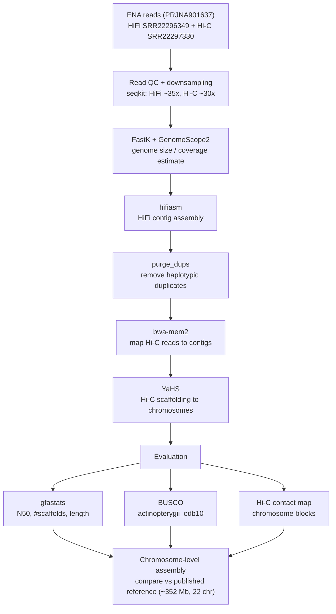

# Workflow

End-to-end pipeline, from public reads to a chromosome-scale, QC-evaluated assembly.
(Rendered as boxes on GitHub via Mermaid; a static image is in `docs/images/workflow.png`.)

```mermaid
flowchart TD
    A["ENA reads (PRJNA901637)<br/>HiFi SRR22296349 + Hi-C SRR22297330"] --> B["Read QC + downsampling<br/>seqkit: HiFi ~35x, Hi-C ~30x"]
    B --> C["FastK + GenomeScope2<br/>genome size / coverage estimate"]
    C --> D["hifiasm<br/>HiFi contig assembly"]
    D --> E["purge_dups<br/>remove haplotypic duplicates"]
    E --> F["bwa-mem2<br/>map Hi-C reads to contigs"]
    F --> G["YaHS<br/>Hi-C scaffolding to chromosomes"]
    G --> H["Evaluation"]
    H --> H1["gfastats<br/>N50, #scaffolds, length"]
    H --> H2["BUSCO<br/>actinopterygii_odb10"]
    H --> H3["Hi-C contact map<br/>chromosome blocks"]
    H1 --> I["Chromosome-level assembly<br/>compare vs published reference (~352 Mb, 22 chr)"]
    H2 --> I
    H3 --> I
```
